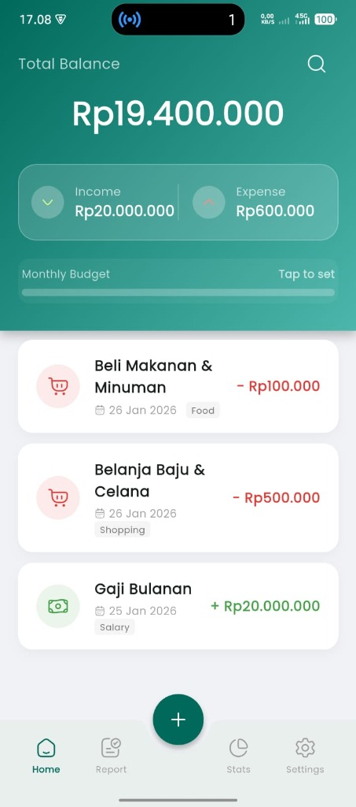
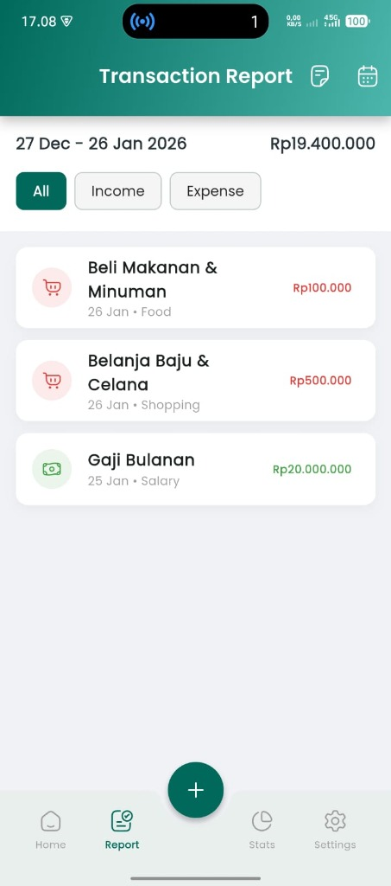
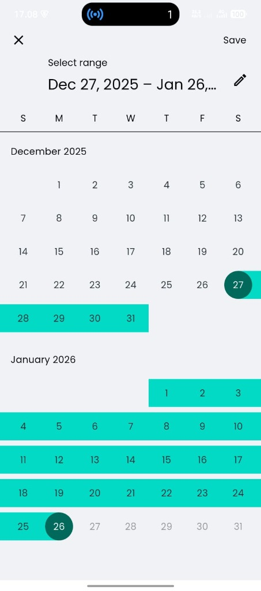
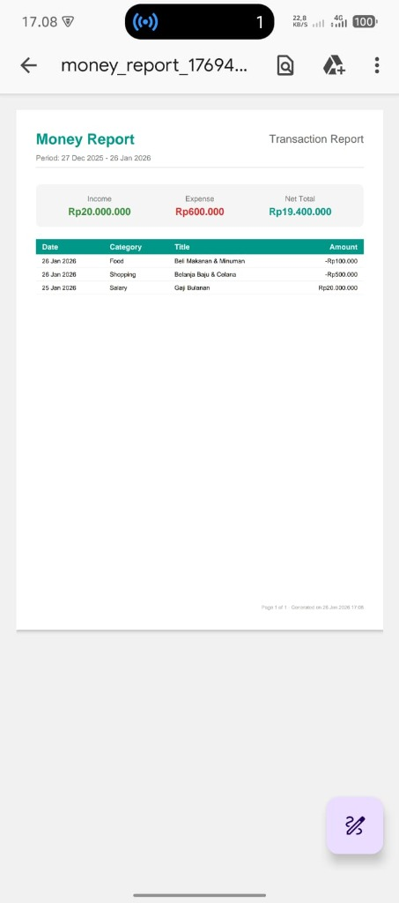
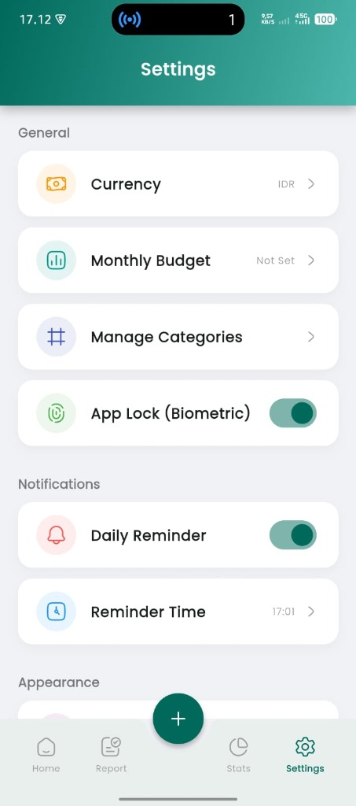

# Money Report 💰

**Version:** 1.0.0+1

Money Report is a comprehensive personal finance management application built with Flutter. It helps you track your income and expenses, manage categories, stick to a monthly budget, and analyze your financial health with detailed reports.

## 📸 Screenshots

|                  Home Screen                   |                      Transaction Report                      |                      Date Picker                      |                    Import/Export                     |                      Settings                      |
| :--------------------------------------------: | :----------------------------------------------------------: | :---------------------------------------------------: | :--------------------------------------------------: | :------------------------------------------------: |
|  |  |  |  |  |

## ✨ Features

- **Transaction Tracking**: Easily record income and expenses.
- **Recurring Transactions**: Set up automatic transactions for bills, salaries, etc.
- **Budgeting**: Set a monthly budget and track your progress.
- **Categories**: Manage custom categories with icons and colors.
- **Reports**: Generate detailed PDF reports and view statistics.
- [x] Verify `README.md` content <!-- id: 35 -->


- **Daily Reminders**: Get notified to record your transactions every day.
- **Biometric Lock**: Secure your data with fingerprint/face unlock.
- **Backup & Restore**: Export your data to JSON and restore it on any device.
- **Dark Mode**: Fully supported dark/light theme.

## 🛠 Technology Stack

- **Framework**: [Flutter](https://flutter.dev/) (Dart)
- **Database**: [sqflite](https://pub.dev/packages/sqflite) (SQLite) - Local storage for transactions and settings.
- **State Management**: [Provider](https://pub.dev/packages/provider)
- **Notifications**: [flutter_local_notifications](https://pub.dev/packages/flutter_local_notifications)
- **Charts**: [fl_chart](https://pub.dev/packages/fl_chart)
- **PDF Generation**: [pdf](https://pub.dev/packages/pdf)

## 📂 Project Structure

```text
lib/
├── main.dart                  # Application entry point
├── models/                    # Data models (Transaction, Category, etc.)
├── providers/                 # State management logic (ChangeNotifiers)
├── screens/                   # UI Screens (Home, Add Transaction, Settings, etc.)
├── services/                  # Business logic services
│   ├── database_helper.dart   # SQLite database operations
│   ├── notification_service.dart # Notification scheduling & management
│   └── ...
└── utils/                     # Helper functions, constants, and theme config
```

## 🚀 Getting Started

1.  **Prerequisites**: Ensure you have Flutter SDK installed.
2.  **Clone the repository**:
    ```bash
    git clone https://github.com/est57/money_report.git
    ```
3.  **Install dependencies**:
    ```bash
    flutter pub get
    ```
4.  **Run the app**:
    ```bash
    flutter run
    ```
